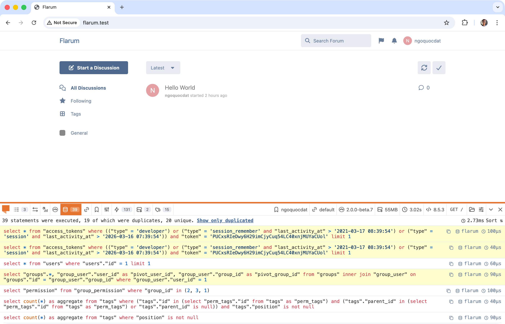
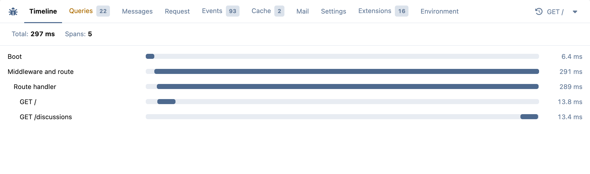
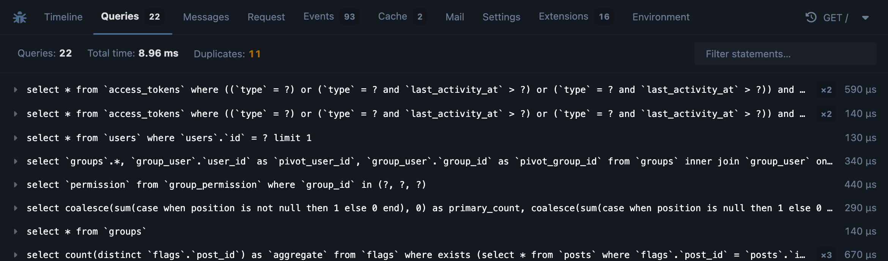
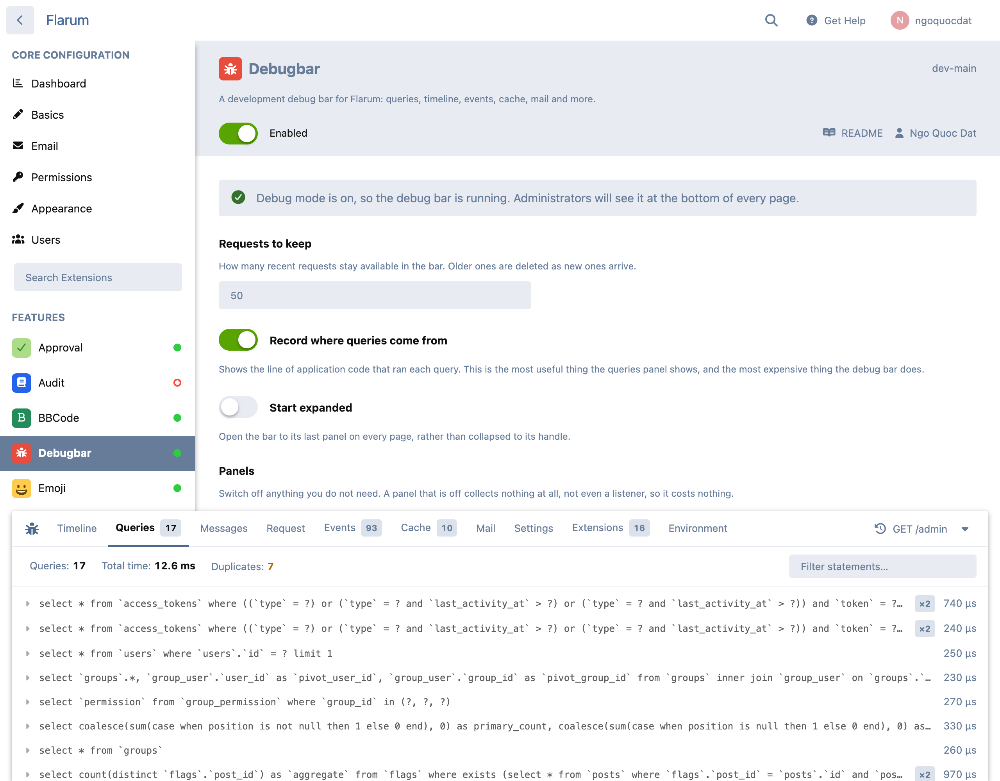

# Debugbar for Flarum

 [](https://packagist.org/packages/datlechin/flarum-debugbar) [](https://packagist.org/packages/datlechin/flarum-debugbar)

A debug bar for Flarum 2.x. It sits at the bottom of every page and tells you what the server actually did: which queries ran and where from, where the time went, which events fired, what was read from the cache, who was authenticated and how.

It is built out of Flarum's own components and design tokens, so it follows your forum's primary colour, colour scheme and dark mode without being told about any of them.

> [!WARNING]
> This is a development tool. It only runs while `debug` mode is on, and it stores request data — including SQL, settings and request headers — under `storage/debugbar`. Never enable debug mode on a production forum.





Collapsed, it still reports the status, the time, the query count and the peak memory for whichever request you are looking at:


## Installation

```sh
composer require datlechin/flarum-debugbar:"*"
```

Enable the extension in the admin panel, then make sure debug mode is on in `config.php`:

```php
'debug' => true,
```

The bar appears for administrators only. There is nothing to publish and nothing to symlink: its assets are compiled through Flarum's own asset pipeline like any other extension's.

### Upgrading from 1.0.x

Nothing to do, but two things have gone.

`php flarum debugbar:publish` no longer exists. It existed to repair a symlink at `public/assets/debugbar`, pointing into the old PHP Debugbar package's resources. That symlink is now unused — nothing reads it and it is harmless — but if you would rather not leave it behind:

```sh
rm public/assets/debugbar
```

`Datlechin\FlarumDebugbar\DebugbarHelper` has been replaced by the `Debugbar` service. If you called it from your own extension, see [Using it from your own extension](#using-it-from-your-own-extension) — the methods have the same names and now come from the container instead of a static.

## Panels

| Panel | What it shows |
| --- | --- |
| Timeline | Where the time went — boot, middleware, the route handler, and each internal API dispatch, drawn to scale and nested |
| Queries | Every statement, with its parameters, the statement with those parameters substituted in, how long it took, and the line of application code that ran it. Repeats of the same statement *with the same parameters* are counted and flagged |
| Messages | Anything your code logged, plus exceptions with their stack traces |
| Request | Method, URI, status, route name and handler, route parameters, query string, JSON:API parameters, and both sets of headers |
| Events | Every event dispatched, in order. Eloquent's model events are counted rather than listed, because there are hundreds of them |
| Cache | Hits, misses, writes, deletions and flushes, with a hit rate |
| Mail | Messages the request sent, including their bodies |
| Settings | The settings table, grouped by the extension that owns each key |
| Extensions | What is installed, what is running, and at what version |
| Environment | Flarum and PHP versions, and the database, cache, queue, session and mail drivers |

Values whose key looks like a credential — passwords, tokens, cookies, CSRF headers — are replaced with `••••••••` before anything is written to disk.

### Dark mode



## Settings



| Setting | Default | |
| --- | --- | --- |
| Requests to keep | 50 | How many recent requests stay available. Older ones are deleted as new ones arrive |
| Record where queries come from | on | The most useful thing the queries panel shows, and the most expensive thing the bar does |
| Start expanded | off | Open the bar on every page, rather than collapsed to its handle |
| Panels | all on | Switch off anything you do not need. A panel that is off collects nothing at all — not even an event listener |

There is also a console command:

```sh
php flarum debugbar:clear   # delete every stored request
```

## Using it from your own extension

Ask the container for the bar and log to it. It is bound whenever this extension is enabled, whether or not debug mode is on — outside debug mode every method is a no-op, so you do not need to guard the call.

```php
use Datlechin\FlarumDebugbar\Debugbar;

class WidgetService
{
    public function __construct(protected Debugbar $debugbar) {}

    public function build(): Widget
    {
        $this->debugbar->info('Building the widget');

        return $this->debugbar->measure('Widget build', function () {
            // ... expensive work, which now has its own bar on the timeline
        });
    }
}
```

From somewhere without constructor injection, `resolve(Debugbar::class)` does the same.

| | |
| --- | --- |
| `info()` `warning()` `error()` `debug()` | Log a message to the Messages panel |
| `exception(Throwable $e)` | Record an exception, with its trace |
| `measure(string $label, callable $work)` | Time a callable and draw it on the timeline. Returns whatever the callable returned, and closes the span even if it throws |
| `startMeasure()` / `stopMeasure()` | The same, when the work does not fit in one callable |

### Adding a panel

Write a collector and register it with the extender. Its `name()` becomes the id of a tab.

```php
// src/Collector/WidgetCollector.php
use Datlechin\FlarumDebugbar\Collector\CollectorInterface;

class WidgetCollector implements CollectorInterface
{
    public function name(): string
    {
        return 'widgets';
    }

    public function collect(ServerRequestInterface $request, ResponseInterface $response): array
    {
        return ['count' => 3, 'names' => ['alpha', 'beta', 'gamma']];
    }
}
```

```php
// extend.php
return [
    (new Datlechin\FlarumDebugbar\Extend\Debugbar())
        ->collector(Acme\Collector\WidgetCollector::class),
];
```

That is enough to get a working tab — anything without a registered frontend panel is rendered as formatted JSON. To draw it properly, register a panel under the same name:

```ts
import { extend } from 'flarum/common/extend';
import Debugbar from 'ext:datlechin/flarum-debugbar/common/components/Debugbar';

extend(Debugbar.prototype, 'panels', (items) => {
  items.add(
    'widgets',
    {
      icon: 'fas fa-cube',
      title: () => app.translator.trans('acme-widgets.lib.debugbar.title'),
      badge: (data) => data.count,
      render: (data) => <WidgetPanel data={data} />,
    },
    95
  );
});
```

Collectors that gather data as the request runs — rather than reading it all at the end — should also implement `SubscribesToEvents`:

```php
public function subscribe(Dispatcher $events): void
{
    $events->listen(WidgetRendered::class, $this->record(...));
}
```

`subscribe()` is called once, and only for collectors the administrator has left switched on, so a panel that is off costs nothing at all.

## How it works

Every request is wrapped by a middleware at the very top of the stack — ahead of the error handler, so a request that failed gets a profile like any other. When the response is ready, each collector is asked for its data, the result is written to `storage/debugbar` under a random id, and that id is returned in an `X-Debugbar-Id` header.

The frontend reads that header off every request the page makes, so the bar lists them all and you can look at any of them. The profile behind a request is fetched from the API only when you actually open it.

Nothing is injected into the HTML, and no assets are published outside Flarum's own pipeline.

## Links

- [Flarum discuss](https://flarum.org/d/38921)
- [GitHub](https://github.com/datlechin/flarum-debugbar)
- [Packagist](https://packagist.org/packages/datlechin/flarum-debugbar)
